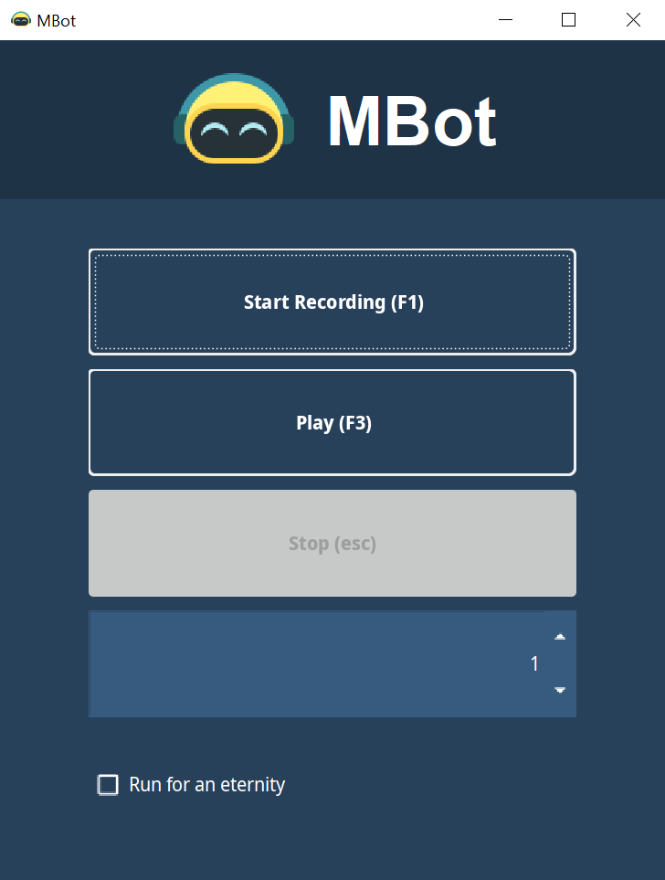
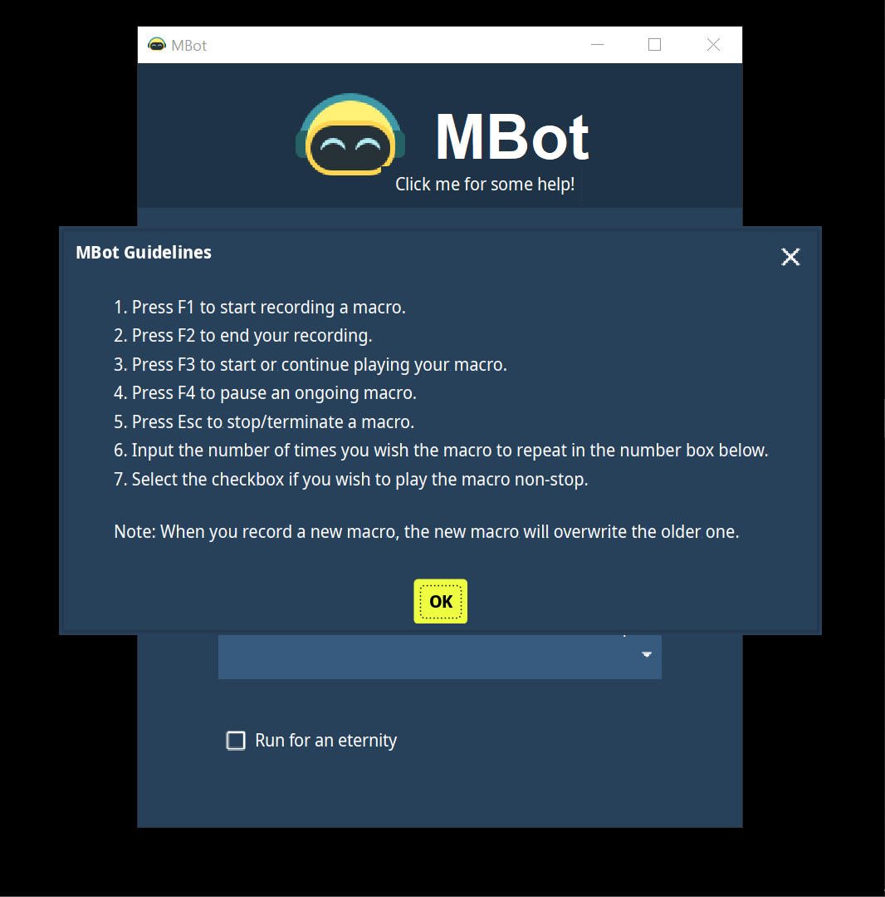

# MBot 

### Description 
A basic desktop program to record and automate mouse and keyboard events. :robot:

### Usage guide
The usage guide can be found by clicking the robot icon in the program.

### Created with
- [jnativehook](https://github.com/kwhat/jnativehook)
- [material-ui-swing](https://github.com/atarw/material-ui-swing)
- [music-robot-icon](https://icons8.com/icon/CHBf5jmRzl9y/music-robot)

### Issues with current version of MBot
- Not support for multiple output files
- Non customizable hotkey (for recording and playing macro)
- Mouse motion generated by the macro may be slower than the original 
- Certain key events may not be working (eg., right alt key is unable to toggle between Hangul and English for Korean Keyboard)

### Welcome contribution!
Any contribution is greatly appreciated.
Feel free to contribute and make MBot better. :wink:
